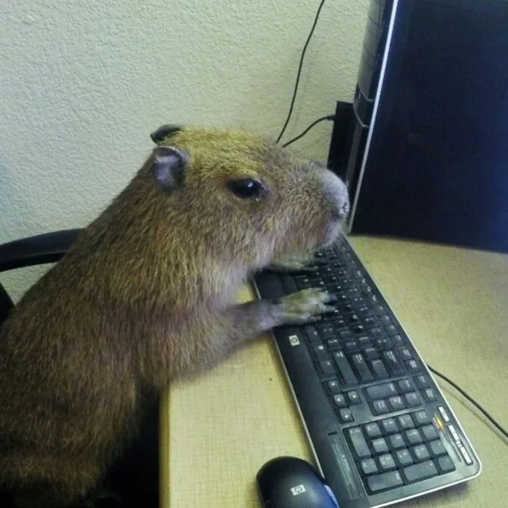

<header style="text-align: center">
    <b style="font-size: 2.5em">👋 Salam!</b> 
    github səhifəmə xoş gəlmişsiniz! ^^
</header>

<main style="display: flex; flex-wrap: wrap; justify-content: center; gap: 24px; margin: 1em; font-size: 1.2em; text-align: center">
    <article style="display: flex; background: #16191d; min-width: 640px; width: 640px; height: 256px; max-height: 256px; border-radius: 16px">
        Mən — Azərbaycan, Bakıdan olan 14 yaşlı bir veb-developerəm.
        
    </article>
    <article style="display: flex; background: #16191d; min-width: 640px; width: 640px; height: 256px; max-height: 256px; border-radius: 16px">
        
        Bəzən React, Vue və Svelte ilə veb-tətbiqlər yaradıram.
    </article>
    <article style="display: flex; background: #16191d; min-width: 640px; width: 640px; height: 256px; max-height: 256px; border-radius: 16px">
        Pişiklərdən, kapibaralardan, bir də Killua Zoldyck-dən xoşum gəlir.
        
    </article>
</main>

<footer style="text-align: center">
    Bu səhifəni həmçinin oxuya bilərsiniz: 

[almanca (Deutsch)](./README-de.md) • [fransızca (français)](./README-fr.md) • [ingiliscə (English)](./README.md) • [ispanca (español)](./README-es.md) • [italyanca (italiano)](./README-it.md) • [rusca (русский)](./README-ru.md) • [türkcə (Türkçe)](./README-tr.md) • [yaponca (日本語)](./README-ja.md)
<footer>